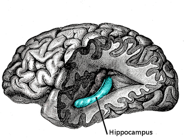

# Header 1

This is some text which does not have to have any meaning. It is here just so that you can see how to make certain
things. For *italics*,**the bold**,***bold and italic*** and ~~strikethrouugh~~. You need
to begin with understanding what markdown is. You can start by learning it [here](https://www.markdowntutorial.com/).


>Blockquote and shit but just added in case it is required.
>
>
> I must explain to you how all this mistaken idea of denouncing of
> a pleasure and praising pain was born and I will give you a complete account of
> the system, and expound the actual teachings of the great explorer of the
> truth, the master-builder of human happiness.

## The Building blocks

To use inline code in something like saying `function rmshit()` actually does shit. I must explain 
to you how all this mistaken idea of denouncing of
a pleasure and praising pain was born and I will give you a complete account of
the system, and expound the actual teachings of the great explorer of the
truth, the master-builder of human happiness. No one rejects, dislikes, or
avoids pleasure itself, because it is pleasure, but because those who do not
know how to pursue pleasure rationally encounter consequences that are
extremely painful. Nor again is there anyone who loves or pursues or desires to
obtain pain of itself, because it is pain, but occasionally circumstances occur
in which toil and pain can procure him some great pleasure. To take a trivial
example, which of us ever undertakes laborious physical exercise, except to
obtain some advantage from it? But who has any right to find fault with a man
who chooses to enjoy a pleasure that has no annoying consequences, or one who
avoids a pain that produces no resultant pleasure?


\newpage

- Unordered List item 1
- Unordered List item 2
  - Nested List item 

1. ordered list item 1
   - nested unordered list item 1
   - nested unordered list item 2
1. ordered list item 2 (actually auto-numbered) see the source.
   1. ordered list item 1
   1. ordered list item 2
1. List 1(there is double space after this if you want the below paragraph to be a part of this list)  
I must explain to you how all this mistaken idea of denouncing of
a pleasure and praising pain was born and I will give you a complete account of
the system, and expound the actual teachings of the great explorer of the
truth, the master-builder of human happiness. No one rejects, dislikes, or

1. There is horizontal rule used below. Don't use it. You don't need it.

---

```
{include=/code/filter_calc.m}
TODO this needs work. see pandoc code filter
```

Below is some python code.

```python
#! /usr/bin/env python3
# From https://raw.githubusercontent.com/lahwaacz/Scripts/master/rmshit.py

import os
import sys
import shutil

def rmshit():
    print("Found shittyfiles:")
    found = []
    for f in shittyfiles:
        absf = os.path.expanduser(f)
        if os.path.exists(absf):
            found.append(absf)
            print("    %s" % f)

    if len(found) == 0:
        print("No shitty files found :)")
        return

    if yesno("Remove all?", default="n"):
        for f in found:
            if os.path.isfile(f):
                os.remove(f)
            else:
                shutil.rmtree(f)
        print("All cleaned")
    else:
        print("No file removed")

thisdict =	{
  "brand": "Ford",
  "model": "Mustang",
  "year": 1964
}
thisdict.pop("model")
print(thisdict)
```

To write H~2~0 and x^2.3^

### Neurons: *Viva La Vida*

Rarely go below header three. That is it. For example this is your citation for
[@razavi_rf_textbook]. To create simple citation bibliography use something like [Zotero's Z-Bib](https://zbib.org/).
The image below is actually oversized but we reduced it's height and width. Use this only for difficult images and 
use percentages and not actual pixels.

{width=50% height=50%}

Here's [a link to something else using tags][another place]. Here's [yet another link][another-link].
And now back to [the first link][another place]. All these examples used reference based linking. Would not
recommend it over citations but your mileage may vary.

[another place]: www.github.com
[another-link]: www.google.com
  
## The need for neural prosthesis

The whole need for prosthesis is to replace the function or structure of the missing body part. Walking with a prosthetic
leg adds to quality of life improvements over not having one. With all the cool processing powers neurons have
, where they fall short is the extent of self-healing/self-repair abilities blessed onto them by nature. If you get a skin
cut, its painful but it does heal and the worst thing that can happen is a scar is left behind. Brain is special in this
regards. Neurons if damaged beyond a certain point cannot reproduce or replicate and take place of the dying neurons. If
there is a damage to neurons most likely it is permanent. [@fivr_intel]

To generate tables use [this](https://www.tablesgenerator.com/markdown_tables)

| Tables   |          Are         |  Cool |
|----------|:--------------------:|------:|
| col 1 is |     left-aligned     | $1600 |
| col 2 is | centeredfhdsfhskdfhk |   $12 |
| col 3 is |  rightffffff-aligned |    $1 |

: Table caption

I must explain to you how all this mistaken idea of denouncing of
a pleasure and praising pain was born and I will give you a complete account of
the system, and expound the actual teachings of the great explorer of the
truth, the master-builder of human happiness.

# How to write math

This is a long text which has an inline equation $L = 100 \mu m$ is there. Tasked with reverse engineering the brain and
here is the footnote as you see[^key_of_footnote]. where do we start? Which of the 100 billion neurons 
should we probe first?
Which neuron is more important? In short how do we make a decision and get started? What adds to the complexity of
studying the brain is that the connections the neurons have with each other are unique and time varying.

(@) $$\int_{0}^{\pi}x^2 \,dx$$

(@) $$I_{d} = {1\over2}*\mu_n*C_{ox}*{W\over L}*\Omega*\omega$$

In order to start understanding the fundamentals
we will focus on Hippocampal Prosthesis, since it has been researched upon. However, if you wish to start with any
other part of brain the principals of developing new siliconal prosthesis will remain the same.
So the references header of the references section is actually manually added.

[^key_of_footnote]: and this is the footnote actual content which can have **bold** and *italics*. 
There is no link to go back to where you came from in PDF which is okay since you are still on the same page. Don't add
unnecessary complexity where you don't need it.


# References

https://ashki23.github.io/markdown-latex.html
